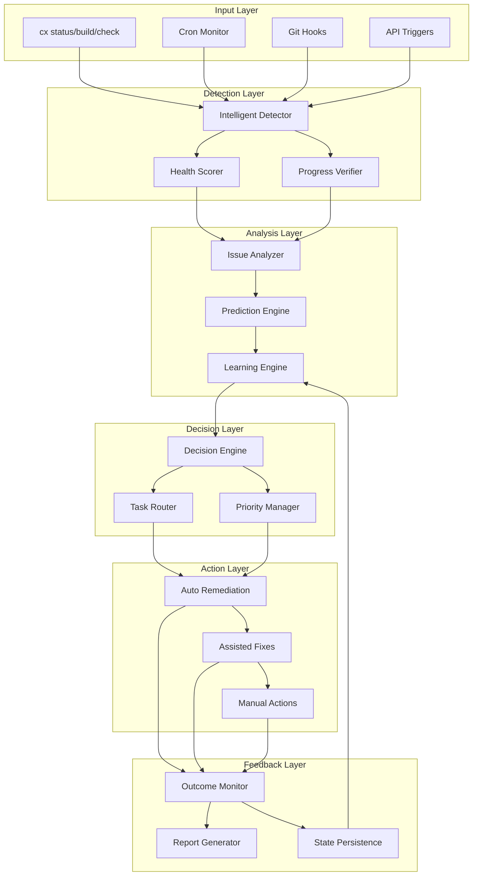

# Task Health Monitoring & Auto-Healing System Architecture

## Executive Summary
A comprehensive, intelligent task health monitoring and auto-healing system that proactively detects, diagnoses, and remediates task issues with minimal user intervention. The system learns from patterns, provides smart recommendations, and automatically fixes common problems.

## System Overview

### Core Philosophy
- **Prevention over Recovery**: Detect issues before they become critical
- **Minimal User Commands**: Ideally just `cx status` handles everything
- **Intelligent Automation**: Auto-heal what can be fixed, provide smart guidance for what cannot
- **Continuous Learning**: System improves over time by learning from patterns

## Architecture Components

### 1. Health Scoring Engine

```javascript
class TaskHealthScore {
  calculateHealthScore(task) {
    const factors = {
      progressVelocity: this.getProgressVelocity(task),        // 20%
      implementationStatus: this.getImplementationStatus(task), // 25%
      dependencyHealth: this.getDependencyHealth(task),        // 15%
      timeEfficiency: this.getTimeEfficiency(task),            // 15%
      blockageRisk: this.getBlockageRisk(task),               // 10%
      communicationFrequency: this.getUpdateFrequency(task),   // 10%
      qualityMetrics: this.getQualityScore(task)              // 5%
    };
    
    return {
      score: this.weightedAverage(factors),
      breakdown: factors,
      trend: this.calculateTrend(task),
      predictedCompletion: this.predictCompletion(task, factors)
    };
  }
}
```

### Health Score Ranges:
- **95-100**: Excellent health, on track
- **80-94**: Good health, minor attention needed
- **60-79**: Fair health, intervention recommended
- **40-59**: Poor health, immediate action required
- **0-39**: Critical, auto-remediation triggered

### 2. Intelligent Detection System

```javascript
class IntelligentDetector {
  async detectIssues(task) {
    return {
      // Real-time Issues
      stuck: await this.detectStuck(task),
      stalled: await this.detectStalled(task),
      falslyCompleted: await this.detectFalseCompletion(task),
      
      // Predictive Issues
      willMissDeadline: await this.predictDeadlineMiss(task),
      dependencyBottleneck: await this.predictBottleneck(task),
      resourceContention: await this.predictResourceConflict(task),
      
      // Pattern-based Issues
      similarTaskFailures: await this.findSimilarFailures(task),
      commonBlockages: await this.detectCommonBlockages(task),
      historicalProblems: await this.checkHistoricalIssues(task)
    };
  }
}
```

### Detection Algorithms:

#### Stuck Task Detection
```javascript
detectStuck(task) {
  const gracePeriods = {
    justStarted: 4 * 3600000,      // 4 hours grace for new tasks
    recentlyReverted: 2 * 3600000,  // 2 hours after reversion
    afterHoliday: 24 * 3600000,     // 24 hours after weekend/holiday
    complexTask: 8 * 3600000        // 8 hours for XL complexity
  };
  
  // Multi-factor stuck detection
  const factors = {
    noProgressTime: this.getTimeSinceProgressChange(task),
    noCommitTime: this.getTimeSinceLastCommit(task),
    noFileChanges: this.getTimeSinceFileChange(task),
    agentInactivity: this.getAgentInactivityTime(task),
    userQueries: this.getUserQueryCount(task)
  };
  
  // Apply intelligent grace periods
  const effectiveGrace = this.calculateGracePeriod(task, gracePeriods);
  
  return {
    isStuck: factors.noProgressTime > effectiveGrace,
    confidence: this.calculateConfidence(factors),
    reason: this.determineStuckReason(factors),
    suggestedAction: this.getSuggestedAction(factors)
  };
}
```

#### False Completion Detection
```javascript
detectFalseCompletion(task) {
  const checks = {
    // Implementation verification
    hasCode: this.verifyCodeImplementation(task),
    hasTests: this.verifyTestImplementation(task),
    hasDocs: this.verifyDocumentation(task),
    
    // Behavior verification
    apiResponsive: this.checkApiEndpoints(task),
    testsPass: this.runTaskTests(task),
    integrationValid: this.checkIntegrations(task),
    
    // Review verification
    peerReviewed: this.checkPeerReview(task),
    userAccepted: this.checkUserAcceptance(task)
  };
  
  const score = this.calculateCompletionScore(checks);
  
  return {
    isFalseCompletion: score < 0.6,
    confidence: this.calculateConfidence(checks),
    missingElements: this.identifyMissing(checks),
    autoFixable: this.canAutoFix(checks)
  };
}
```

### 3. Auto-Remediation Engine

```javascript
class AutoRemediationEngine {
  async remediate(task, issues) {
    const remediations = [];
    
    // Priority 1: Critical Issues (Automatic)
    if (issues.falslyCompleted && issues.falslyCompleted.autoFixable) {
      remediations.push(await this.fixFalseCompletion(task));
    }
    
    if (issues.stuck && issues.stuck.confidence > 0.8) {
      remediations.push(await this.unstuckTask(task));
    }
    
    // Priority 2: Dependency Resolution
    if (issues.dependencyBottleneck) {
      remediations.push(await this.resolveDependencies(task));
    }
    
    // Priority 3: Performance Optimization
    if (task.healthScore < 60) {
      remediations.push(await this.optimizeTask(task));
    }
    
    return {
      applied: remediations.filter(r => r.success),
      failed: remediations.filter(r => !r.success),
      recommendations: await this.generateRecommendations(task, issues)
    };
  }
}
```

### Remediation Strategies:

#### Level 1: Automatic Fixes (No User Input)
```javascript
const automaticFixes = {
  revertFalseCompletion: async (task) => {
    task.status = 'in-progress';
    task.progress = Math.max(10, task.lastVerifiedProgress || 0);
    await this.createRevertCommit(task);
    await this.notifyAgent(task, 'TASK_REVERTED');
  },
  
  unblockDependency: async (task) => {
    const readyDeps = await this.checkDependencyReadiness(task);
    task.dependencies.blocked_by = task.dependencies.blocked_by
      .filter(dep => !readyDeps.includes(dep));
    if (task.dependencies.blocked_by.length === 0) {
      task.status = 'ready';
    }
  },
  
  assignToAgent: async (task) => {
    const bestAgent = await this.findBestAgent(task);
    await this.createAgentWorkflow(task, bestAgent);
    task.assignedAgent = bestAgent;
    task.workflowStarted = new Date();
  },
  
  breakDownComplexTask: async (task) => {
    if (task.complexity === 'XL' && task.progress < 20) {
      const subtasks = await this.intelligentDecompose(task);
      await this.createSubtasks(subtasks);
      task.status = 'decomposed';
    }
  }
};
```

#### Level 2: Assisted Fixes (Minimal User Confirmation)
```javascript
const assistedFixes = {
  resolveConflict: async (task) => {
    const conflicts = await this.detectConflicts(task);
    const resolution = await this.proposeResolution(conflicts);
    
    console.log(`Conflict detected: ${conflicts.description}`);
    console.log(`Proposed resolution: ${resolution.action}`);
    console.log('Press ENTER to apply, or type "skip"');
    
    const response = await getUserInput();
    if (response !== 'skip') {
      await resolution.apply();
    }
  },
  
  mergeParallelWork: async (task) => {
    const parallel = await this.findParallelWork(task);
    if (parallel.length > 0) {
      console.log(`Found ${parallel.length} parallel implementations`);
      const merged = await this.intelligentMerge(parallel);
      console.log('Review merged result? [Y/n]');
      // ...
    }
  }
};
```

### 4. Progress Verification System

```javascript
class ProgressVerification {
  async verifyProgress(task) {
    const verifications = {
      // File-based verification
      files: await this.verifyFiles(task),
      
      // Code analysis
      code: await this.analyzeCode(task),
      
      // Test verification
      tests: await this.verifyTests(task),
      
      // Integration verification
      integration: await this.verifyIntegration(task),
      
      // Documentation verification
      docs: await this.verifyDocumentation(task)
    };
    
    return {
      realProgress: this.calculateRealProgress(verifications),
      claimedProgress: task.progress,
      discrepancy: Math.abs(task.progress - this.calculateRealProgress(verifications)),
      evidence: verifications,
      recommendation: this.getProgressRecommendation(verifications)
    };
  }
  
  async verifyFiles(task) {
    const expectedFiles = task.implementation_notes.files_to_create || [];
    const modifiedFiles = task.implementation_notes.files_to_modify || [];
    
    const checks = await Promise.all([
      ...expectedFiles.map(file => this.checkFileExists(file)),
      ...modifiedFiles.map(file => this.checkFileModified(file, task.started_at))
    ]);
    
    return {
      expected: expectedFiles.length + modifiedFiles.length,
      found: checks.filter(c => c).length,
      missing: checks.map((c, i) => !c ? [...expectedFiles, ...modifiedFiles][i] : null).filter(Boolean)
    };
  }
}
```

### 5. Intelligent Task Routing

```javascript
class IntelligentRouter {
  async routeTask(task, issues) {
    // Analyze task characteristics
    const analysis = {
      domain: await this.analyzeDomain(task),
      complexity: await this.analyzeComplexity(task),
      dependencies: await this.analyzeDependencies(task),
      skills: await this.requiredSkills(task),
      history: await this.analyzeHistory(task)
    };
    
    // Find best agent/approach
    const routing = {
      primaryAgent: await this.selectPrimaryAgent(analysis),
      supportAgents: await this.selectSupportAgents(analysis),
      workflow: await this.selectWorkflow(analysis),
      parallelizable: await this.checkParallelization(analysis),
      estimatedTime: await this.estimateCompletion(analysis)
    };
    
    // Generate execution plan
    return {
      immediate: routing.parallelizable ? 'START_PARALLEL' : 'START_SEQUENTIAL',
      agent: routing.primaryAgent,
      workflow: routing.workflow,
      confidence: this.calculateRoutingConfidence(routing),
      alternativePaths: await this.getAlternativePaths(analysis)
    };
  }
}
```

### 6. Learning Engine

```javascript
class LearningEngine {
  async learn(task, outcome) {
    // Pattern recognition
    await this.updatePatterns({
      taskType: task.category,
      complexity: task.complexity,
      duration: outcome.duration,
      issues: outcome.issues,
      resolutions: outcome.resolutions,
      success: outcome.success
    });
    
    // Update heuristics
    await this.updateHeuristics({
      stuckThreshold: this.adjustThreshold('stuck', outcome),
      graceePeriods: this.adjustGracePeriods(outcome),
      agentPerformance: this.updateAgentMetrics(outcome),
      workflowEfficiency: this.updateWorkflowMetrics(outcome)
    });
    
    // Generate insights
    return {
      learned: await this.generateInsights(outcome),
      recommendations: await this.improveProcess(outcome),
      adjustments: await this.proposeAdjustments(outcome)
    };
  }
}
```

## Data Flow Architecture



## Decision Trees

### Main Health Check Decision Tree
```
START
├── Is task healthy? (score > 80)
│   ├── Yes → Continue normal operation
│   └── No → Proceed to issue detection
│
├── Critical issues detected?
│   ├── False completion? → AUTO: Revert and restart
│   ├── Stuck > 4 hours? → AUTO: Analyze and unstuck
│   └── Dependencies blocked? → AUTO: Check and unblock
│
├── Medium issues detected?
│   ├── Low progress velocity? → ASSIST: Suggest decomposition
│   ├── Resource conflict? → ASSIST: Propose resolution
│   └── Missing tests? → ASSIST: Generate test templates
│
└── Minor issues detected?
    ├── Documentation outdated? → SUGGEST: Update docs
    ├── Code quality issues? → SUGGEST: Refactor
    └── Performance concerns? → SUGGEST: Optimization
```

### Auto-Remediation Decision Tree
```
ISSUE_DETECTED
├── Can fix automatically?
│   ├── Yes → Apply fix → Verify → Log
│   └── No → Can assist?
│       ├── Yes → Generate solution → Get confirmation → Apply
│       └── No → Generate recommendation → Notify user
│
├── Fix successful?
│   ├── Yes → Update learning model → Continue
│   └── No → Escalate to next level
│       ├── Try alternative fix
│       ├── Request human intervention
│       └── Mark for manual review
```

## Implementation Strategy

### Phase 1: Enhanced Detection (Week 1)
```javascript
// Enhance existing task-health-monitor.js
class EnhancedHealthMonitor extends TaskHealthMonitor {
  constructor() {
    super();
    this.scorer = new TaskHealthScore();
    this.verifier = new ProgressVerification();
    this.predictor = new PredictionEngine();
  }
  
  async comprehensiveCheck(task) {
    const health = {
      score: await this.scorer.calculateHealthScore(task),
      issues: await this.detectIssues(task),
      verification: await this.verifier.verifyProgress(task),
      predictions: await this.predictor.predictOutcome(task)
    };
    
    return this.analyzeHealth(health);
  }
}
```

### Phase 2: Auto-Remediation (Week 2)
```javascript
// New auto-remediation-engine.js
class RemediationEngine {
  async processTask(task, health) {
    // Categorize issues
    const issues = this.categorizeIssues(health);
    
    // Apply automatic fixes
    const autoFixes = await this.applyAutomaticFixes(task, issues.critical);
    
    // Prepare assisted fixes
    const assistedFixes = await this.prepareAssistedFixes(task, issues.medium);
    
    // Generate recommendations
    const recommendations = await this.generateRecommendations(task, issues.minor);
    
    return {
      applied: autoFixes,
      pending: assistedFixes,
      suggestions: recommendations
    };
  }
}
```

### Phase 3: Learning Integration (Week 3)
```javascript
// New learning-engine.js
class TaskLearningEngine {
  async learn(tasks, outcomes) {
    // Extract patterns
    const patterns = await this.extractPatterns(tasks, outcomes);
    
    // Update models
    await this.updateModels(patterns);
    
    // Generate insights
    const insights = await this.generateInsights(patterns);
    
    // Improve thresholds
    await this.optimizeThresholds(insights);
    
    return insights;
  }
}
```

## Integration with cx CLI

### Enhanced cx status command
```bash
cx status
# Shows comprehensive health dashboard with auto-fixes applied

cx status --fix
# Applies all automatic remediations

cx status --assist
# Interactive mode for assisted fixes

cx status --predict
# Shows predicted issues and preventive actions
```

### New cx health command
```bash
cx health
# Comprehensive health analysis

cx health --monitor
# Real-time monitoring mode

cx health --history
# Historical health trends

cx health --learn
# Show learning insights
```

## Monitoring & Metrics

### Key Performance Indicators
1. **Mean Time to Detection (MTTD)**: < 2 hours
2. **Auto-remediation Success Rate**: > 80%
3. **False Positive Rate**: < 5%
4. **Task Completion Velocity**: +25% improvement
5. **User Intervention Rate**: < 20% of issues

### Health Metrics Dashboard
```javascript
class HealthDashboard {
  generateMetrics() {
    return {
      overall: {
        healthScore: 85,
        tasksMonitored: 45,
        issuesDetected: 12,
        autoFixed: 9,
        requiresAttention: 3
      },
      
      trends: {
        healthImprovement: '+12%',
        velocityIncrease: '+18%',
        blockageReduction: '-35%'
      },
      
      predictions: {
        upcomingBottlenecks: 2,
        estimatedDelays: '2.5 days',
        preventableIssues: 5
      }
    };
  }
}
```

## Best Practices & Patterns

### Pattern: Grace Period Management
```javascript
const gracePeriods = {
  // Context-aware grace periods
  calculate(task, context) {
    let base = 2 * 3600000; // 2 hours base
    
    // Adjust for complexity
    base *= this.complexityMultiplier[task.complexity];
    
    // Adjust for time of day
    if (this.isOutsideWorkHours()) base *= 2;
    
    // Adjust for recent events
    if (context.recentlyReverted) base *= 1.5;
    if (context.holidayRecent) base *= 3;
    
    // Adjust for task history
    if (task.previousAttempts > 2) base *= 1.25;
    
    return base;
  }
};
```

### Pattern: Intelligent Escalation
```javascript
const escalation = {
  levels: [
    { threshold: 0.9, action: 'auto_fix' },
    { threshold: 0.7, action: 'assist_fix' },
    { threshold: 0.5, action: 'recommend' },
    { threshold: 0.3, action: 'alert_user' },
    { threshold: 0.0, action: 'escalate_pm' }
  ],
  
  determine(confidence, severity) {
    const score = confidence * severity;
    return this.levels.find(l => score >= l.threshold).action;
  }
};
```

### Pattern: Failure Recovery
```javascript
const recovery = {
  async attemptRecovery(task, failure) {
    const strategies = [
      this.rollbackStrategy,
      this.retryStrategy,
      this.alternativeStrategy,
      this.decompositionStrategy,
      this.escalationStrategy
    ];
    
    for (const strategy of strategies) {
      const result = await strategy.attempt(task, failure);
      if (result.success) {
        await this.learn(strategy, result);
        return result;
      }
    }
    
    return this.finalEscalation(task, failure);
  }
};
```

## Security & Safety Considerations

### Safe Operations
1. **Always create backups** before auto-remediation
2. **Verify critical changes** with user confirmation
3. **Rate limit auto-fixes** to prevent cascade failures
4. **Audit trail** for all automated actions
5. **Rollback capability** for all changes

### Guard Rails
```javascript
const guardRails = {
  maxAutoFixes: 10, // Per hour
  requireConfirmation: ['delete', 'revert', 'merge'],
  prohibitedActions: ['force_push', 'delete_branch'],
  criticalTasks: ['TASK-001', 'TASK-002'], // Require manual intervention
  
  canAutoFix(action, task) {
    if (this.prohibitedActions.includes(action)) return false;
    if (this.criticalTasks.includes(task.id)) return false;
    if (this.requireConfirmation.includes(action)) return false;
    if (this.getRecentFixCount() >= this.maxAutoFixes) return false;
    return true;
  }
};
```

## Conclusion

This comprehensive task health monitoring and auto-healing system provides:

1. **Proactive Detection**: Issues identified before they become critical
2. **Intelligent Remediation**: Automatic fixes with confidence scoring
3. **Minimal User Burden**: Most issues resolved without intervention
4. **Continuous Learning**: System improves over time
5. **Safety First**: Guard rails prevent dangerous operations
6. **Full Visibility**: Complete audit trail and metrics

The system transforms task management from reactive firefighting to proactive health maintenance, dramatically improving development velocity and reducing cognitive load on the team.

## Next Steps

1. **Review and approve** this architecture
2. **Implement Phase 1** (Enhanced Detection)
3. **Test with existing tasks** for calibration
4. **Deploy Phase 2** (Auto-Remediation)
5. **Gather metrics** and iterate
6. **Deploy Phase 3** (Learning Engine)
7. **Full production rollout**

---

*Architecture Version: 1.0*  
*Last Updated: 2025-08-27*  
*Status: Ready for Implementation*