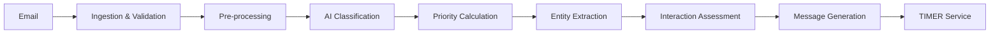
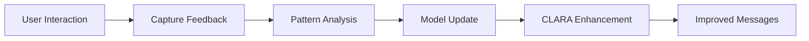
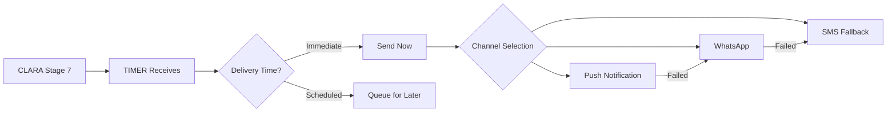

# School'cierge Product Architecture Document

**Version:** 4.0  
**Status:** Aligned with PRD & TRD  

## Purpose
This document defines the high-level architecture supporting the School'cierge platform requirements defined in PRD-DEV.md and implemented through TRD-DEV.md specifications.

## Related Documents
- Product Requirements Document (PRD-DEV.md)
- Technical Requirements Document (TRD-DEV.md)
- PRD-TRD Alignment Document (PRD-TRD-ALIGNMENT.md)

---

## Architecture Stack

### Mobile Application
```yaml
Framework: Expo SDK 50+
  - Native iOS/Android apps
  - OTA updates
  - Managed workflow
  
State Management: React Query + Zustand
  - Server state with React Query
  - Local UI state with Zustand
  - Online-first with intelligent caching
  
Push Notifications: Expo Push
  - Single API for iOS/Android
```

### Backend Services (with Clerk Auth)
```yaml
Railway Infrastructure:
  PostgreSQL: Primary database
  Redis: BullMQ job queues
  
  Express API:
    - CLARA: 7-stage email processing
    - TIMER: Delivery orchestration
    - ADAPT: Learning & personalization
    - Queue workers integrated

External Services:
  - Clerk: Authentication
    • WhatsApp OTP (custom layer)
    • Google OAuth (built-in)
    • Apple OAuth (built-in)
    • Email magic links
  - Whapi.Cloud: WhatsApp primary
  - 2Chat.io: WhatsApp backup
  - Claude 3.5 Sonnet: AI processing
  - Mailgun: Email ingestion
```

### Infrastructure
```yaml
Hosting: Railway Pro
  - PostgreSQL & Redis included
  - Automatic scaling & backups
  - Single deployment platform
  
Auth: Clerk
  - Managed authentication service
  - Social login included
  - Multi-factor authentication
```

---

## Domain Architecture

### Customer Domain (schoolcierge.com)
- **www.schoolcierge.com** → Marketing website
- **app.schoolcierge.com** → Web companion for families
- **help.schoolcierge.com** → Support documentation

### Internal Domain (schoolcierge.app)
- **api.schoolcierge.app** → Backend API with integrated CLARA & queues
- **admin.schoolcierge.app** → Admin panel (IP restricted)

---

## CLARA Architecture

### Overview
CLARA processes emails through 7 stages, then hands off to TIMER for delivery.

### Service Structure
```typescript
class CLARAService {
  // Stage 1: Email Ingestion & Validation
  async ingestEmail(webhook: EmailWebhook): Promise<IngestedEmail>
  
  // Stage 2: Pre-processing & Deduplication
  async preprocessEmail(email: IngestedEmail): Promise<PreprocessedEmail>
  
  // Stage 3: AI Classification
  async classifyContent(email: PreprocessedEmail): Promise<Classification>
  
  // Stage 4: Priority Calculation
  async calculatePriority(classification: Classification): Promise<Priority>
  
  // Stage 5: Entity Extraction
  async extractEntities(email: PreprocessedEmail): Promise<ExtractedEntities>
  
  // Stage 6: Interaction Assessment
  async assessInteraction(entities: ExtractedEntities): Promise<InteractionLevel>
  
  // Stage 7: Message Generation
  async generateMessage(context: ProcessedContext): Promise<GeneratedMessage>
  
  // Hand off to TIMER for delivery
  async handoffToTimer(message: GeneratedMessage): Promise<void>
}
```

### Processing Pipeline (7 Stages)


### Stage Details

#### Stage 1-2: Ingestion & Pre-processing
```json
{
  "email_id": "msg_abc123_2024031409",
  "family_id": "fam_chen_dubai_456",
  "sender": {
    "email": "teacher@dubaiintlacademy.ae",
    "domain": "dubaiintlacademy.ae",
    "trust_score": 85,
    "is_verified": true
  },
  "content": {
    "subject": "Swimming Carnival Permission Required",
    "body": "parsed_email_content",
    "attachments": [{
      "filename": "permission_slip.pdf",
      "size": 245760,
      "url": "signed_download_url"
    }]
  },
  "metadata": {
    "received_at": "2024-03-14T09:32:00Z",
    "thread_id": "thread_swimming_2024",
    "is_duplicate": false,
    "preprocessing_flags": ["attachment_detected", "deadline_present"]
  }
}
```

#### Stage 3-4: AI Classification & Priority
```json
{
  "classification": {
    "primary_category": "permission_request",
    "secondary_categories": ["school_event", "form_required"],
    "confidence_score": 94.2,
    "requires_action": true
  },
  "priority": {
    "score": 75,
    "band": "high",
    "factors": {
      "urgency": 8,
      "impact": 7,
      "deadline_proximity": 9,
      "authority_level": 10
    },
    "calculated_by": "Priority Score = (8×0.4) + (7×0.3) + (9×0.3) = 8.0"
  }
}
```

#### Stage 5-6: Entity Extraction & Interaction Assessment
```json
{
  "extracted_entities": {
    "children": ["Emma Chen"],
    "event": "Year 5 Swimming Carnival",
    "date": "2024-03-15",
    "deadline": "2024-03-13",
    "location": "Dubai Aquatic Centre",
    "required_actions": ["sign_permission", "return_form"],
    "attachments": ["permission_slip.pdf"]
  },
  "interaction_assessment": {
    "level": 2,
    "complexity": "medium",
    "time_required": "2 minutes",
    "actions_needed": ["download_form", "sign_form", "return_slip"],
    "can_defer": false,
    "requires_physical_action": true
  }
}
```

#### Stage 7: Message Generation
```json
{
  "generated_message": {
    "template_id": "permission_request_urgent",
    "personalization": {
      "child_name": "Emma",
      "parent_name": "Mrs. Chen"
    },
    "content": {
      "text": "📎 Permission needed - Emma's swimming carnival\n📅 Friday, March 15\n⏰ Form due Wednesday (2 days)",
      "buttons": [
        {"text": "Complete Permission", "action": "open_form"},
        {"text": "Set Reminder", "action": "schedule_reminder"}
      ]
    },
    "metadata": {
      "action_id": "complete_permission_swimming_2024",
      "tracking_required": true,
      "reminder_schedule": "24h_before"
    }
  },
  "handoff_to_timer": {
    "delivery_time": "immediate",
    "reminder_times": ["2024-03-12T09:00:00Z"],
    "escalation_time": "2024-03-13T15:00:00Z"
  }
}
```

---

## ADAPT Agent Architecture

### Overview
ADAPT learns from user behavior to improve CLARA's classification accuracy over time.

### Core Components
```typescript
class ADAPTAgent {
  // Learning Pipeline
  async captureUserFeedback(interaction: UserInteraction): Promise<void>
  async analyzePatterns(familyId: string): Promise<BehaviorPattern[]>
  async updateClassificationRules(patterns: Pattern[]): Promise<void>
  
  // Personalization Engine
  async personalizeActions(familyId: string, actions: Action[]): Promise<PersonalizedActions>
  async adjustPriorities(familyId: string, priority: Priority): Promise<AdjustedPriority>
  
  // Performance Monitoring
  async trackAccuracy(familyId: string): Promise<AccuracyMetrics>
  async generateInsights(period: DateRange): Promise<Insights[]>
}
```

### Learning Process


### Feedback Loop Integration
- Tracks every user interaction with notifications
- Learns from dismissals, clicks, and action completions
- Adjusts classification confidence thresholds per family
- Personalizes message formatting and timing

---

## TIMER Architecture

### Overview
TIMER handles all delivery, scheduling, and time-sensitive operations.

### Core Components
```typescript
class TIMERService {
  // Message Delivery (from CLARA Stage 7)
  async deliverMessage(message: GeneratedMessage): Promise<DeliveryResult>
  async routeToChannels(delivery: DeliveryPlan): Promise<ChannelResults>
  async trackDelivery(messageId: string): Promise<DeliveryStatus>
  
  // Scheduling Engine
  async scheduleReminder(reminder: Reminder): Promise<ScheduledJob>
  async scheduleRecurring(pattern: CronPattern, task: Task): Promise<RecurringJob>
  async scheduleDelivery(message: Message, time: Date): Promise<ScheduledDelivery>
  
  // Event Processing
  async processDeadline(deadline: Deadline): Promise<void>
  async handleEventApproaching(event: CalendarEvent): Promise<void>
  
  // Batch Operations
  async runDailyDigest(familyId: string): Promise<void>
  async processWeeklyReview(familyId: string): Promise<void>
  
  // Delivery Tracking
  async confirmDelivery(channelResult: ChannelResult): Promise<void>
  async handleDeliveryFailure(failure: DeliveryFailure): Promise<void>
  async triggerFallback(originalChannel: Channel): Promise<void>
}
```

### Job Queue Architecture
```yaml
timerQueue:
  delivery_jobs:
    - immediate_delivery      # From CLARA Stage 7
    - scheduled_delivery      # User-preferred times
    - channel_fallback        # WhatsApp/SMS fallback
    - delivery_tracking       # Confirmation & receipts
    
  scheduled_jobs:
    - reminder_notifications
    - deadline_alerts
    - recurring_events
    - digest_generation
    - follow_up_checks
  
  schedules:
    - immediate: priority > 80 or user action required
    - deferred: based on user preferences
    - hourly: check approaching deadlines
    - daily: digest at user preferred time
    - weekly: summary reports
```

### Delivery Flow from CLARA


---

## Action Matrix Architecture

### Overview
Action Matrix maps email classifications to specific actions for intelligent routing.

### Matrix Structure
```typescript
interface ActionMatrix {
  classification: string
  priority_band: 'critical' | 'high' | 'medium' | 'low'
  actions: {
    primary: ActionType
    secondary?: ActionType[]
    fallback: ActionType
  }
  routing: {
    recipients: RecipientRule[]
    timing: DeliveryTiming
    channels: Channel[]
  }
  tracking: {
    required: boolean
    reminder_schedule?: ReminderPattern
    escalation?: EscalationRule
  }
}
```

### Dynamic Routing Examples
```json
{
  "permission_request": {
    "priority_band": "high",
    "actions": {
      "primary": "complete_form",
      "secondary": ["set_reminder", "add_calendar"],
      "fallback": "notify_only"
    },
    "routing": {
      "recipients": ["primary_parent", "if_shared_custody_both"],
      "timing": "immediate",
      "channels": ["push", "whatsapp"]
    }
  }
}
```

---

## Queue Processing Architecture

### BullMQ Job Queues
```typescript
// Email Processing Queue
emailQueue: 
  - Receives emails from Mailgun webhook
  - Runs CLARA 7-stage pipeline
  - Outputs to TIMER for delivery

// TIMER Queue (Primary Delivery)
timerQueue:
  - Receives messages from CLARA Stage 7
  - Manages all message delivery
  - Handles channel selection & fallback
  - Scheduled notifications
  - Deadline reminders
  - Batch processing

// Notification Queue (Channel-Specific)
notificationQueue:
  - Push notifications via Expo
  - WhatsApp messages via Whapi.Cloud
  - SMS fallback for critical messages
  - Delivery confirmation tracking

// Reminder Queue  
reminderQueue:
  - User-scheduled reminders
  - System-generated follow-ups
  - Deadline approaching alerts
  - Escalation notifications
```


---

## Repository Structure

```
schoolcierge/
├── apps/
│   ├── mobile/                 # Expo app
│   │   ├── src/
│   │   │   ├── screens/
│   │   │   ├── components/
│   │   │   ├── hooks/
│   │   │   ├── services/
│   │   │   └── utils/
│   │   └── app.json
│   ├── api/                    # Express API
│   │   ├── src/
│   │   │   ├── routes/
│   │   │   ├── services/
│   │   │   ├── middleware/
│   │   │   ├── clara/          # CLARA service module
│   │   │   └── workers/        # BullMQ job processors
│   │   │       ├── emailProcessor.ts
│   │   │       ├── notificationSender.ts
│   │   │       └── reminderScheduler.ts
│   │   └── package.json
│   ├── admin/                  # Admin dashboard
│   │   └── src/
│   └── web-app/                # Family web companion
│       └── src/
├── packages/
│   ├── database/               # Prisma schemas
│   ├── types/                  # Shared TypeScript
│   └── ui/                     # Shared components
├── infrastructure/
│   ├── railway.json
│   └── docker-compose.yml
└── package.json                # Monorepo root
```

---

## Database Architecture

### Two-Layer Database Strategy

**Backend (Railway)**
- PostgreSQL 15 - Primary data store
- Redis - Caching and queues
- Both managed by Railway with automatic backups

**Mobile (Device)**
- React Query - Server state caching
- localStorage - Persistent cache for last-known state
- No offline database complexity

### Core Tables (PostgreSQL)
```sql
-- Users & Authentication
users (Clerk integrated)
auth_sessions
families
family_members

-- Children & Schools
children
schools
child_schools
educational_platforms
family_educational_apps

-- Communications
communications
ai_classifications
action_items
calendar_events
notifications

-- CLARA Processing
clara_emails
clara_classifications
clara_messages
clara_deliveries
```

### Key Design Principles
- Row-Level Security (RLS) for family isolation
- JSONB for flexible school/app data
- Soft deletes for compliance
- Audit trails on all tables

---

## API Architecture

### Endpoint Structure
```
/api/v1/
├── /auth                    # Clerk JWT validation
├── /families               # Family management
├── /children               # Child profiles
├── /schools                # School selection
├── /communications         # Email history
├── /actions                # Task management
├── /calendar               # Event management
├── /notifications          # Delivery preferences
└── /webhooks              # External integrations
```

### Security Layers
1. Clerk JWT authentication
2. Family context middleware
3. Rate limiting per family
4. Request validation (Zod)
5. CORS restrictions

---

## Push Notification Delivery Architecture

### Multi-Channel Delivery Strategy
```typescript
class NotificationDeliveryService {
  async deliver(notification: Notification): Promise<DeliveryResult> {
    // 1. Attempt push notification via Expo
    const pushResult = await this.sendPushNotification(notification)
    
    // 2. Wait for delivery confirmation (max 30 seconds)
    if (await this.confirmDelivery(pushResult, 30000)) {
      return { status: 'delivered', channel: 'push' }
    }
    
    // 3. Fallback to WhatsApp
    const whatsappResult = await this.sendWhatsApp(notification)
    if (whatsappResult.success) {
      return { status: 'delivered', channel: 'whatsapp' }
    }
    
    // 4. Final fallback to SMS for critical messages
    if (notification.priority >= 80) {
      const smsResult = await this.sendSMS(notification)
      return { status: 'delivered', channel: 'sms' }
    }
    
    return { status: 'failed', retryAfter: 3600 }
  }
}
```

### Push Notification Features
```yaml
Rich Notifications:
  - Custom sounds per category
  - Action buttons (iOS/Android)
  - Images and attachments
  - Deep linking to app sections
  - Badge count management

Delivery Tracking:
  - Receipt confirmation
  - Read receipts
  - Interaction tracking
  - Fallback triggers

Channel Priority:
  1. Native push (free, instant)
  2. WhatsApp (reliable, rich media)
  3. SMS (critical only, costly)
```

### Expo Push Service Integration
```typescript
interface PushNotificationPayload {
  to: ExpoPushToken[]
  title: string
  body: string
  data?: Record<string, any>
  sound?: 'default' | 'notification.wav'
  badge?: number
  categoryId?: string // For action buttons
  attachments?: Array<{
    url: string
    type: 'image' | 'video' | 'audio'
  }>
}

// Action button categories
const notificationCategories = {
  'permission_request': [
    { id: 'complete', title: 'Complete Form' },
    { id: 'remind', title: 'Remind Later' }
  ],
  'payment_reminder': [
    { id: 'view', title: 'View Details' },
    { id: 'snooze', title: 'Snooze' }
  ]
}
```

---

## Integration Points

### WhatsApp Provider (Whapi.Cloud)
- **Primary**: Whapi.Cloud
- **Backup**: 2Chat.io
- **Interface**: Provider-agnostic adapter pattern
- **Features**: Templates, buttons, media, receipts, no WABA required

### AI Processing
- **Primary**: Claude 3.5 Sonnet
- **Fallback**: GPT-4 or Gemini
- **Configuration**: Environment-based selection

### Email Reception (Mailgun)
- **Primary**: Mailgun (webhooks, forwarding)
- **Domain**: fwd.schoolcierge.com
- **Pattern**: {family-id}@fwd.schoolcierge.com
- **Requirements**: Webhooks, attachments, SPF/DKIM validation

---

## Deployment Architecture

### Railway Services
```yaml
services:
  api:
    source: ./apps/api
    domains: [api.schoolcierge.app]
    env:
      DATABASE_URL: ${{postgres.DATABASE_URL}}
      REDIS_URL: ${{redis.REDIS_URL}}
    
  admin:
    source: ./apps/admin
    domains: [admin.schoolcierge.app]
    
  web-app:
    source: ./apps/web-app
    domains: [app.schoolcierge.com]
    
    
  postgres:
    image: postgres:15
    volumes: [data:/var/lib/postgresql/data]
    
  redis:
    image: redis:7-alpine
```

### Environment Strategy
- **Production**: main branch auto-deploy
- **Staging**: staging branch with test data
- **Development**: Local with Railway DB connection

---

## Performance Requirements

### Technical Specifications
- Email→WhatsApp: <5 seconds
- API response: <100ms
- App launch: <2 seconds
- Offline capability: React Query caching


---

## Security Architecture

### Data Protection
- AES-256 encryption at rest
- TLS 1.3 in transit
- Row-Level Security (RLS) for family isolation
- GDPR compliance

### Access Control
- Biometric authentication (mobile)
- JWT tokens (30-minute expiry)
- Admin IP restrictions
- API rate limiting

---

---

